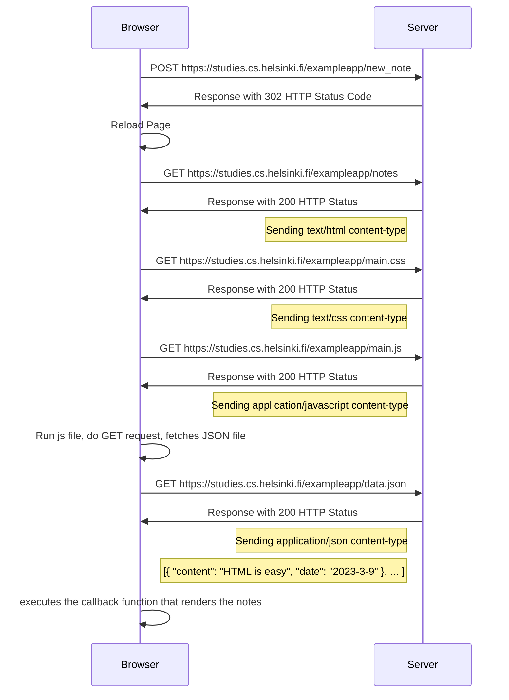

```mermaid

sequenceDiagram
    Browser->>Server: POST https://studies.cs.helsinki.fi/exampleapp/new_note
    Server->>Browser: Response with 302 HTTP Status Code
    Browser->>Browser: Reload Page
    Browser->>Server: GET https://studies.cs.helsinki.fi/exampleapp/notes
    Server->>Browser: Response with 200 HTTP Status
    Note left of Server: Sending text/html content-type
    Browser->>Server: GET https://studies.cs.helsinki.fi/exampleapp/main.css
    Server->>Browser: Response with 200 HTTP Status
    Note left of Server: Sending text/css content-type
    Browser->>Server: GET https://studies.cs.helsinki.fi/exampleapp/main.js
    Server->>Browser: Response with 200 HTTP Status
    Note left of Server: Sending application/javascript content-type
    Browser->>Browser: Run js file, do GET request, fetches JSON file
    Browser->>Server: GET https://studies.cs.helsinki.fi/exampleapp/data.json
    Server->>Browser: Response with 200 HTTP Status
    Note left of Server: Sending application/json content-type
    Note left of Server: [{ "content": "HTML is easy", "date": "2023-3-9" }, ... ]
    Browser->>Browser: executes the callback function that renders the notes

```