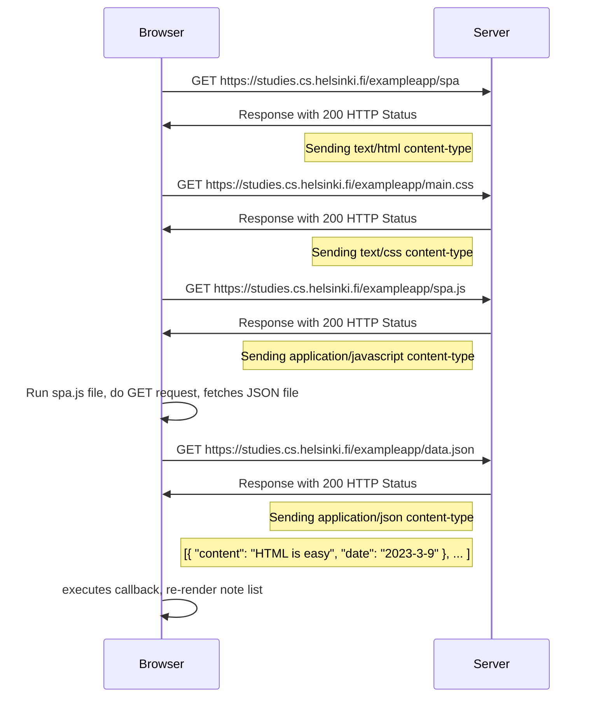

```mermaid

sequenceDiagram
    Browser->>Server: GET https://studies.cs.helsinki.fi/exampleapp/spa
    Server->>Browser: Response with 200 HTTP Status
    Note left of Server: Sending text/html content-type
    Browser->>Server: GET https://studies.cs.helsinki.fi/exampleapp/main.css
    Server->>Browser: Response with 200 HTTP Status
    Note left of Server: Sending text/css content-type
    Browser->>Server: GET https://studies.cs.helsinki.fi/exampleapp/spa.js
    Server->>Browser: Response with 200 HTTP Status
    Note left of Server: Sending application/javascript content-type
    Browser->>Browser: Run spa.js file, do GET request, fetches JSON file
    Browser->>Server: GET https://studies.cs.helsinki.fi/exampleapp/data.json
    Server->>Browser: Response with 200 HTTP Status
    Note left of Server: Sending application/json content-type
    Note left of Server: [{ "content": "HTML is easy", "date": "2023-3-9" }, ... ]
    Browser->>Browser: executes callback, re-render note list

```